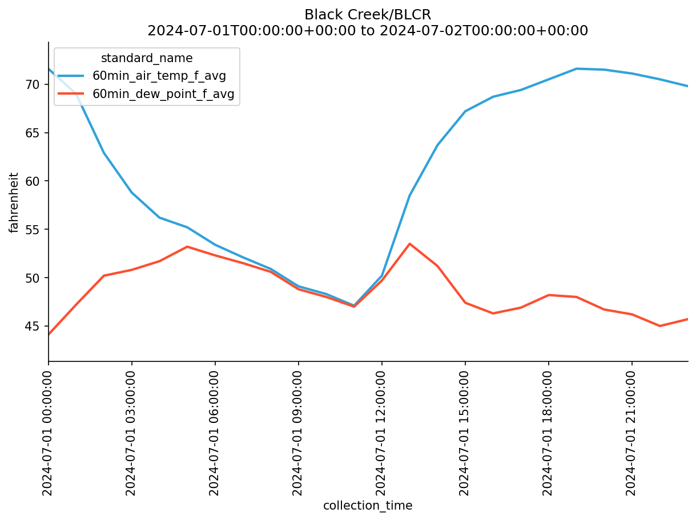

# Open Source Agricultural Forecasting and Advisory System API
This open-source forecasting tool provides plant disease predictions both as an API and through a customizable dashboard.

## Acknowledgements:
This is an initiative of the Open source Program Office at the University of Madison-Wisconsin.
Visit our Dashboard:
- [Link](https://connect.doit.wisc.edu/tarspot_forecasting_app/)
- [GitHub Repo](https://github.com/UW-Madison-DSI/corn_disease_forecast_api.git)

## ag_models_wrappers
The ag_models_wrappers serve as the critical layer for providing crop model-based risk assessments tailored to weather data on specific locations eg Wisconet Stations or punctual locations in Wisconsin by IBM data. This component integrates various forecasting models to deliver localized risk predictions for plant diseases for a given forecasting date, enabling informed decision-making in agricultural management.
- Wisconet API Wrapper: This REST API simplifies communication between the Wisconet API service and our dashboard. We developed an API that dynamically retrieves data from available weather stations, fetching daily and hourly variables necessary for the input of various disease models.
- IBM API Wrapper: This REST API facilitates communication between the IBM paid service and our dashboard. Access to the IBM service is secured with an API key.
Both APIs are open-source and can be integrated into other processes. Note that the IBM API requires an API key for access.
See below the documentation.

## pywisconet
This API wrapper represents an interface for interacting with Wisconet v1 data. The intended objective is to provide a streamlined method for accessing weather and environmental data from Wisconet's network of stations, enabling users to integrate this data into their own applications and forecasting models for agricultural and environmental analysis.


API Documentation: [API](https://connect.doit.wisc.edu/pywisconet_wrapper/docs)

For more information on how to use our API, please visit the material section.

## Installation and Setup
To set up and run the API locally, follow these steps:

```
git clone git@github.com:UW-Madison-DSI/pywisconet.git
cd pywisconet
python -m venv venv
source venv/bin/activate  # On Windows use: venv\Scripts\activate
pip install -r requirements.txt
uvicorn app:app --reload
```

The models presented herein constitute the foundation of our Open Source Agricultural Forecasting and Advisory System, which underpins the [APP](https://github.com/UW-Madison-DSI/corn_disease_forecast_api.git) 


# pywisconet


## usage
```python
# define date range to collect bulk measures data
start_date = datetime(2024,7,1, tzinfo=ZoneInfo("UTC"))
end_date = datetime(2024,7,2, tzinfo=ZoneInfo("UTC"))

# collect station details from wisconet API
stations = all_stations()
this_station = stations[2]
this_station_fields = station_fields(this_station.station_id)

# select desired measure standard names from available fields
filtered_field_standard_names = filter_fields(
    this_station_fields, 
    criteria=[
        MeasureType.AIRTEMP, 
        MeasureType.DEW_POINT,
        CollectionFrequency.MIN60,
        Units.FAHRENHEIT
    ]
)

# collect bulk measures data from Wisconet API
bulk_measure_response = bulk_measures(
    station_id=this_station.station_id, 
    start_time=start_date, 
    end_time=end_date,
    fields=filtered_field_standard_names
)

# process Wisconet data format to pandas Dataframe and plot
hv.extension('matplotlib')
df = bulk_measures_to_df(bulk_measure_response)
mpl_fig = hv.render(
    df
    .hvplot
    .line(
        x="collection_time", 
        y="value",
        by="standard_name",
        ylabel=Units.FAHRENHEIT.value,
        rot=90,
        width=800, 
        height=400,
        legend="top_left",
        title=f"{this_station.station_name}/{this_station.station_id}\n"
              f"{start_date.isoformat()} to {end_date.isoformat()}"
    )
)
mpl_fig.savefig("specific_data_specific_time.png")
```


### see more examples in the notebooks/examples.ipynb
